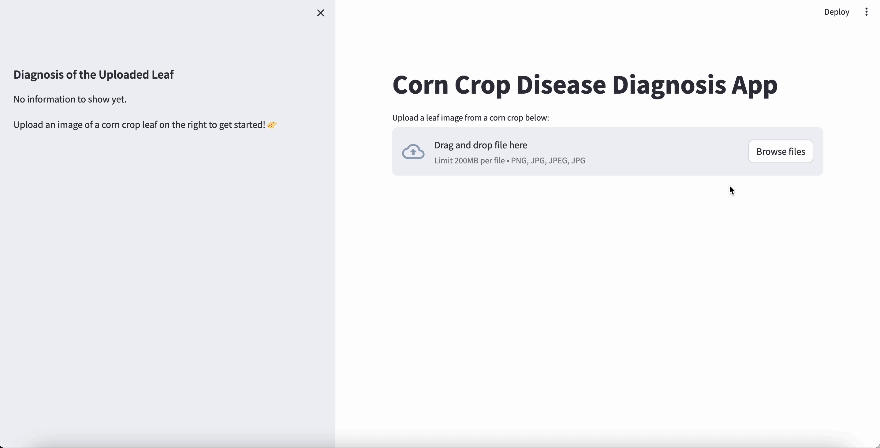

# Deep Learning Final Project: Plant Disease Image Classification of Corn Crop Leaves
MSDS 634 Deep Learning, Spring 2024

Professor: Mustafa Hajij

Team Members: Amadeo Cabanela, Gaurav Goyal, Jiaxuan Ouyang, Liang(Arios) Tong

## About this repository:
* `final_notebook.ipynb` - Comprehensive notebook containing all code and outputs for EDA, preprocessing, model experiments, and final model results.
* `other_model_notebooks` - Folder containing multiple notebooks containing raw code for model experiments.
* `presentation_slides.pdf` - PDF file of our slides from our video presentation.
* `webapp` - folder containing files for Streamlit web application
  * `demo_images` - sample test images to test the webapp

## Video Presentation
If you'd like to watch a presentation about our project, you can view it here:

https://drive.google.com/file/d/1ZDPxbgVzz_WYlfNYpKys0V5q9VyqaDiu/view?usp=sharing

## Medium Post
We wrote a blog post on the Medium platform. You can read it here:

https://medium.com/@acabanela/plant-disease-classification-of-corn-crop-leaves-27d5db52de55

## Streamlit Web Application
We developed a webapp using Streamlit that allows users to upload leaf images for classification using our final model.

### Usage
To demo the webapp yourself, follow these steps:
1. Clone this github repo.
1. `cd` into the `webapp` folder
1. Install the required libraries by running `pip install -r requirements.txt`
1. We used Python 3.11.3
1. Run the Streamlit app with the command `streamlit run app.py`
1. Visit the app in your browser by visiting `http://localhost:8501`
1. Have fun upload images and exploring information about different disease classes! Sample images are available in the `demo_images` folder.

## Special Thanks
Thanks to Professor Mustafa Hajij for an interesting and engaging class for deep learning!